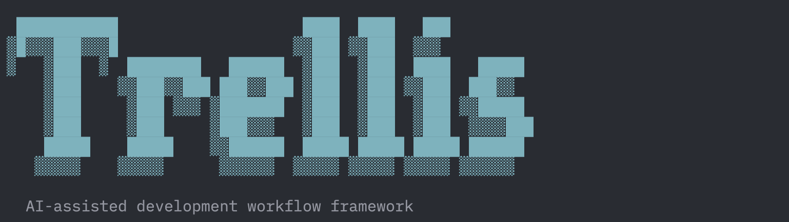

# Trellis

English | [中文](./README-zh.md)



AI capabilities grow like ivy — full of vitality but climbing in all directions. Trellis provides the structure to guide them along a disciplined path.

Based on Anthropic's [Effective Harnesses for Long-Running Agents](https://www.anthropic.com/engineering/effective-harnesses-for-long-running-agents), with engineering practices and improvements for real-world usage.

## Installation

```bash
npm install -g @mindfoldhq/trellis    # or pnpm/yarn
```

## Quick Start

```bash
# Initialize in your project
trellis init
# or use short alias
tl init

# Initialize with developer name
trellis init -u your-name

# Initialize for specific tools only
trellis init --cursor          # Cursor only
trellis init --claude          # Claude Code only
trellis init --cursor --claude # Both (default)
```

## What It Does

Trellis creates a structured workflow system in your project:

```
your-project/
├── .trellis/
│   ├── .developer                 # Developer identity (gitignored)
│   ├── workflow.md                    # Workflow guide
│   ├── agent-traces/            # Session tracking
│   │   └── {developer}/           # Per-developer progress
│   │       ├── index.md           # Progress index
│   │       ├── features/          # Feature tracking
│   │       │   ├── {day}-{name}/  # Feature directory
│   │       │   │   └── feature.json
│   │       │   └── archive/       # Completed features
│   │       └── progress-N.md      # Session records
│   ├── structure/                 # Development guidelines
│   │   ├── frontend/              # Frontend standards
│   │   ├── backend/               # Backend standards
│   │   └── guides/                # Thinking guides
│   └── scripts/                   # Utility scripts
│       ├── common/                # Shared utilities
│       │   ├── paths.sh           # Path utilities
│       │   ├── developer.sh       # Developer management
│       │   └── git-context.sh     # Git context
│       ├── feature.sh             # Feature management
│       ├── add-session.sh         # Record sessions
│       ├── get-context.sh         # Get session context
│       ├── get-developer.sh       # Get developer name
│       └── init-developer.sh      # Initialize developer
├── .cursor/commands/              # Cursor slash commands
├── .claude/commands/              # Claude Code slash commands
├── init-agent.md                  # AI onboarding guide
└── AGENTS.md                      # Agent instructions
```

## Key Features

### 1. Multi-Developer Support

Each developer (human or AI) gets their own progress tracking:

```bash
./.trellis/scripts/init-developer.sh <name>
```

### 2. Slash Commands

Pre-built commands for AI assistants:

| Command | Purpose |
|---------|---------|
| `/init-agent` | Initialize AI session with context |
| `/before-frontend-dev` | Read frontend guidelines before coding |
| `/before-backend-dev` | Read backend guidelines before coding |
| `/check-frontend` | Validate frontend code against guidelines |
| `/check-backend` | Validate backend code against guidelines |
| `/check-cross-layer` | Verify cross-layer consistency |
| `/finish-work` | Pre-commit checklist |
| `/record-agent-flow` | Record session progress |
| `/break-loop` | Deep bug analysis |
| `/onboard-developer` | Full workflow onboarding |

### 3. Thinking Guides

Structured guides to prevent common mistakes:

- Cross-layer thinking guide
- Code reuse thinking guide
- Pre-implementation checklist

### 4. Feature Tracking

Track features with directory-based structure:

```bash
./.trellis/scripts/feature.sh create my-feature  # Create feature
./.trellis/scripts/feature.sh list               # List active features
./.trellis/scripts/feature.sh archive my-feature # Archive completed
```

## CLI Commands

```bash
trellis init              # Initialize workflow
trellis init -u <name>    # Initialize with developer name
trellis init -y           # Skip prompts, use defaults
trellis init -f           # Force overwrite existing files
trellis init -s           # Skip existing files
```

## How It Works

1. **AI reads `init-agent.md`** at session start
2. **Follows guidelines** in `.trellis/structure/`
3. **Updates progress** in `.trellis/agent-traces/`
4. **Uses slash commands** for common tasks

This creates a structured, documented workflow where:
- AI agents maintain context across sessions
- Work is tracked and auditable
- Code quality standards are enforced
- Multiple agents can collaborate

## Acknowledgments

Trellis is built upon ideas and inspirations from:

- [Anthropic](https://www.anthropic.com/) - For the foundational research on [Effective Harnesses for Long-Running Agents](https://www.anthropic.com/engineering/effective-harnesses-for-long-running-agents)
- [OpenSkills](https://github.com/numman-ali/openskills) - For pioneering the skills system that extends Claude's capabilities
- [Exa](https://exa.ai/) - For the powerful web search and code context capabilities that significantly enhance AI agent performance

## License

FSL-1.1-MIT (Functional Source License, MIT future license)

Copyright © Mindfold LLC
